<h1 align="center">George Politis</h1>
<h3 align="center">Technologist | Platform Engineering | SRE | DevSecOps | AI</h3>

  <a href="mailto:geo.politis@gmail.com">Email</a> •
  <a href="https://github.com/geopolitis">GitHub</a> •
  <a href="https://www.linkedin.com/in/georgepolitis">LinkedIn</a> •
  <a href="https://opsatscale.com">Blog</a>

  

---

## About me

I’m **George Politis**, a **technologist** based in **London, UK**.

My background spans:
- Platform engineering
- SRE
- DevSecOps
- Cloud engineering
- Software engineering
- AI, data, security, and operations

I focus on building resilient platforms, improving delivery systems, strengthening security, and applying AI in practical engineering environments.

---

## Featured repositories

### [GPT-playground](https://github.com/geopolitis/GPT-playground)
Playground for GPT experiments and prototyping.

### [Vault-policy-validator](https://github.com/geopolitis/Vault-policy-validator)
Python tooling for validating Vault policies.

### [MCP-f-Secrets](https://github.com/geopolitis/MCP-f-Secrets)
Secrets-related workflows and MCP experimentation.

### [SRE_maturity_assesment](https://github.com/geopolitis/SRE_maturity_assesment)
Ideas and utilities around SRE maturity assessment.

### [mistral-RL-scripts](https://github.com/geopolitis/mistral-RL-scripts)
Scripts for Mistral-based fine-tuning and evaluation workflows.

### [buddies](https://github.com/geopolitis/buddies)
Smaller Python tooling project.

---

## Thought leadership

- LLM & Agent Vulnerability Taxonomy 2026
- From Infrastructure to Intelligence: Re-architecting the Digital Trust Economy
- The natural evolution of DevSecOps into ConsciousOps
- Ops at Scale framework

Read more on my blog: [opsatscale.com](https://opsatscale.com)

---

## GitHub stats

GitHub since **2012**. Public work here is mostly **Python**, with **Rust** also represented in active projects.

  
  

---

## Core areas

`Platform Engineering` `SRE` `DevSecOps` `Cloud` `Observability` `Security Automation` `Resilience` `FinOps` `AI/LLM` `Data Platforms`

---

## Connect

- Email: [geo.politis@gmail.com](mailto:geo.politis@gmail.com)
- GitHub: [@geopolitis](https://github.com/geopolitis)
- LinkedIn: [georgepolitis](https://www.linkedin.com/in/georgepolitis)
- Blog: [opsatscale.com](https://opsatscale.com)
